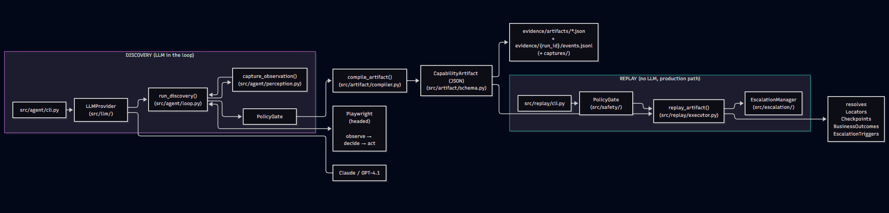

# Design Write-up: Computer-Use Automation System

## 1. Architecture

This is not a hypothetical diagram -- every arrow above has been exercised against a real target
(`mock_bank_app/`) with real evidence on disk: a genuine LLM-driven discovery run producing
`evidence/artifacts/lookup_and_open_subaccount.json`, and multiple replay runs against that same
artifact covering success (different member, correct parameterized output), a declared business
outcome (`member_not_found`), and a declared escalation trigger (`session_expired`) that correctly
surfaces as a hard failure when a human resumes without actually resolving it -- see section 3.

Key decisions made up front:

- **Provider-agnostic LLM interface** (`src/llm/base.py`): the discovery loop's model-selection
  is isolated behind a single `LLMProvider.decide_next_action` method. Anthropic and OpenAI
  adapters implement it via tool-calling / function-calling respectively. This matters because
  the *replay* path never calls an LLM at all -- provider choice, cost, and availability are
  entirely a discovery-time concern, never a production-reliability concern.
- **Accessibility-tree observation, not screenshots** (`src/agent/perception.py`): the model
  reasons over role+name element lists, not pixels. This is the direct answer to "bias toward an
  approach that still works when the surface has no clean DOM" -- the accessibility tree is
  populated by the browser from semantics, independent of markup quality, and the same
  abstraction exists for desktop apps (see section 4).
- **Single-process, synchronous, no queue.** Given the scope note against building scaling
  infrastructure prematurely, discovery and replay both run as direct Playwright calls in one
  process. The architecture that *would* scale this (a queue between "capability requested" and
  "replay executed", a worker pool per tenant) is describable without being built -- see section 4.
- **Stable, one-year-old accessibility API over a two-week-old nicer one.** Perception is built on
  `page.locator("body").aria_snapshot()` (YAML, stable since Playwright v1.49), parsed with PyYAML
  plus a small per-leaf regex. Playwright v1.63.0 (released ~Sept 2026, about two weeks before this
  was written) added `ariaSnapshotJSON()`, which would have been a nicer shape to parse directly.
  I didn't use it: the discovery run is the one requirement in this project that cannot be
  mocked or allowed to be flaky, and building that on an API that had barely shipped -- with no
  way to fully verify its Python-binding behavior in the time available -- was the wrong place to
  take on version risk. Boring-and-proven beat new-and-nicer for this one path specifically.
- **My own per-turn element refs, not Playwright's native `aria-ref` mechanism** (the one
  Playwright's own MCP/AI tooling uses internally). That mechanism is explicitly documented as
  valid only within a single snapshot and goes stale the moment the page changes -- fine for an
  LLM's immediate next click, useless for a `CapabilityArtifact` a replay engine needs to resolve
  months later against a *different* page load. I assign my own ephemeral ref (`e0`, `e1`, ...)
  per observation, resolved via the fully public `page.get_by_role(role, name=...)` API. The model
  gets the same ergonomic benefit (pick an opaque id, never invent a selector); the artifact
  compiler converts the winning run's `(ref -> role/name)` pairs into a durable `Locator` the model
  never has to reason about at all.

## 2. Artifact schema

See `src/artifact/schema.py`. Design rationale:

- `business_outcomes` is a first-class list, separate from `steps`, because the most common
  design mistake in this domain is conflating "no such member" with a crash. Anything the caller
  needs to know as a legitimate answer must appear here, not be inferred from an exception.
- Locators are strategy + ordered fallback chain, never a single selector -- `role_name` primary
  (accessibility tree), `text` and `css`/`xpath` as fallbacks for surfaces where roles aren't
  exposed. Which locator resolved is itself evidence (see section 3), giving a future drift-detection
  signal without building drift detection now.
- `value_ref` / `output_ref` indirection means no literal PII or account data is ever baked into a
  saved artifact -- an artifact is a *template*, callable with different inputs, which is what
  makes it a capability rather than a recorded macro.
- `created_from_run_id` links to discovery evidence instead of embedding the transcript --
  the transcript may contain incidental on-screen PII and free-text model reasoning that has no
  place in a document meant to be reviewed as a contract.
- `risk` per step + `review_status` on the artifact is the hook for conservative handling of
  irreversible actions (section 6).
- `escalation_triggers` is a declared list, structurally parallel to `business_outcomes`, for
  conditions the capability knows it cannot resolve itself (see section 5) -- "stuck" is data on
  the artifact, not an implicit fallback in the replay code.
- A fourth locator strategy, `LABEL_SIBLING`, exists specifically for non-interactive data fields
  in a "label cell, value cell" table layout (e.g. reading a savings balance): the value itself has
  no role or accessible name of its own, only its neighboring label does. Kept as its own strategy
  rather than an overload of `TEXT` (which asserts plain text presence, used by checkpoints and
  business outcomes) so a `Step` is self-describing on its own -- see LocatorStrategy's docstring
  and section 4's discovery of this gap during review for the full reasoning, and section 7 for the
  scope this convention covers.

## 3. Determinism & error handling

Result taxonomy (`ReplayResult` / `ReplayStatus`), evaluated in this priority order at every
checkpoint:

1. **success** -- the success checkpoint is reached; declared outputs extracted.
2. **business_outcome** -- a declared `BusinessOutcome` matched (e.g. member not found, permission
   denied). Not a failure; a typed answer the caller needs.
3. **escalated** -- a declared `EscalationTrigger` matched (e.g. session expired mid-flow). The
   artifact has explicitly named this as a condition it cannot resolve deterministically; the run
   pauses and hands the live session to a human rather than guessing (see section 5).
4. **hard_failure** -- nothing above matched within timeout. Evidence (screenshot + accessibility
   snapshot) captured before returning; `FailureDetail` states which step, what was expected, what
   was observed. By default (`escalate_on_unclassified_hard_failure=True`) even this genuinely
   unanticipated case is routed to a human first, since in a regulated-banking workflow "ask a
   person" is a better default than "fail silently" -- overridable per-artifact for low-stakes,
   read-only capabilities where fail-fast to the caller is preferable instead.

**Distinguishing "the click failed" from "the content is just slow".** The mock app's slow-load
case (`00003`, ~6s render delay) is handled by keeping two checkpoints separate rather than one:
the navigation/search-redirect checkpoint (near-instant) and a dedicated `WAIT_FOR` step targeting
the balance field specifically, with its own generous `timeout_ms`. Every checkpoint is evaluated
by polling (short interval, up to `timeout_ms`) rather than a single one-shot check -- "the click
didn't throw" is not evidence the page finished loading. If replay fails, the evidence shows
*which* of these two independently-verifiable conditions didn't hold, rather than one generic
timeout.

**Native browser dialogs (`confirm()`) are per-step data, not a separate step type.** The
sub-account confirmation page triggers a real JS `confirm()` dialog, which fires *synchronously
inside* the Playwright call that causes it -- there is no way to "click" and then, as a later
step, "accept the dialog"; the handler must be registered before the triggering call runs. Rather
than adding a disconnected `ACCEPT_DIALOG` step (which would force the replay executor to look
ahead and couple two steps together), `Step.expects_dialog` is a field on the triggering step
itself (see `DialogPolicy` in the schema). During discovery, a blanket dialog handler auto-accepts
(discovery is trying to succeed) but every dialog that fires is recorded as a `DialogEvent`
attached to that turn -- if this recording were skipped, the compiled artifact would look
identical to a run with no dialog at all, and replay would hang or fail the first time it hit the
same dialog for real, since replay deliberately does NOT use a blanket handler: it registers a
one-shot handler only for the exact step that declares `expects_dialog`, so an *unexpected* dialog
anywhere else is correctly treated as a hard failure rather than silently swallowed.

**Locator resolution must match between discovery and replay, exactly.** Discovery resolves
`role_name` locators via `page.get_by_role(role, name=name, exact=True)`. The replay executor
reconstructs the identical call, `exact=True` included -- Playwright's default name matching is
substring and case-insensitive, so omitting `exact=True` on either side risks the same artifact
resolving to two different elements depending on which path executes it. This is exactly the kind
of silent mismatch a schema-level contract can't catch on its own; it's enforced by convention
between `src/agent/perception.py` and `src/replay/executor.py`, documented in both.

Determinism is achieved by: no model in the replay decision loop at all; locator fallback chains
tried in a fixed order; explicit checkpoints (not "the click didn't throw") gating every
state-changing step.

**Stretch goal: multi-run stability.** `src/replay/cli.py --repeat N` replays the same artifact
and inputs N times and reports a per-status breakdown (`success` / `business_outcome` /
`escalated` / `hard_failure`) as a flakiness signal. Deliberately does NOT create N evidence run
folders -- all attempts share one `EvidenceLogger` (one `run_id`), bracketed by `attempt_start`/
`attempt_result` log lines and a final `stability_summary`; only failure-capture filenames are
attempt-prefixed, to avoid one attempt's screenshot overwriting another's. `hard_failure` is
treated as the only real stability red flag -- `business_outcome`/`escalated` are legitimate,
expected alternate paths across repeated runs, not evidence the replay mechanics themselves are
flaky. The `attempt` parameter threaded through `replay_artifact` defaults to `None` and changes
nothing about a plain single replay -- the existing test suite (`tests/test_replay_executor.py`)
exercises the unchanged default path.

**Checkpoints are evaluated against a combined text surface (title + URL + visible body text),
not title or body alone.** Our own compiler builds per-step checkpoints from the resulting page's
*title* ("page advanced to 'Member Detail'"), while business outcomes and escalation triggers are
typically authored against *body* text -- e.g. the mock app's not-found page has title "No Member
Found" but body text "No member found matching ID..."; the declared `contains="No member found"`
(lowercase) only matches the body, not the title. The schema doesn't record which surface an
assertion was written against, so the executor checks the union of both -- the only choice that
makes every assertion actually resolvable without adding a field nobody populates today.

**Locator resolution logs which strategy actually resolved**, including whether it was a fallback
rather than the primary -- the same "which locator won" signal named in section 4 as the future
drift-detection hook, now actually emitted (`"act"` events in the evidence log).

**Three real bugs were found and fixed through actual replay testing, not just review, worth
recording honestly:**
1. *Dialog handlers accumulated across steps.* The first version registered a fresh one-shot
   listener per step; `.once()` only removes itself after firing, so steps with no dialog left
   theirs registered indefinitely, and by the time the real confirm() fired, several stale
   listeners raced to handle the same dialog -- producing `"Cannot dismiss dialog which is
   already handled!"` and making accept-vs-dismiss a race rather than a decision. Fixed by
   registering exactly one persistent handler for the whole run, driven by which step is
   currently executing (mirroring how `src/agent/loop.py` already does this correctly).
2. *`LABEL_SIBLING` targeted the wrong element.* `get_by_text(exact=True)` resolves to the
   innermost element with that exact text -- for `<td><b>Label:</b></td>`, that's the `<b>`, which
   has no siblings of its own. The fix climbs to the nearest enclosing `<td>` first
   (`ancestor-or-self::td[1]/following-sibling::*[1]`), and verifies the sibling actually resolves
   to something *before* considering the locator successful, rather than returning a lazy,
   possibly-empty Locator that only fails much later when something calls `.inner_text()` and
   hangs for Playwright's full default timeout.
3. *An unresolved escalation could be silently treated as success.* After a human resumed from an
   escalation, the code re-checked the step's outcome but only had explicit branches for
   `business_outcome` and `hard_failure` -- if the re-check came back `escalated` again (the human
   resumed without actually fixing anything), neither branch matched, and execution fell through
   to the success path unguarded. Confirmed in testing: escalating on a simulated session-expiry,
   resuming without fixing it, and watching the executor proceed to the next step anyway. Fixed by
   making the post-re-check handling exhaustive -- escalate at most once per step, then require an
   explicit `status == "ok"` before treating anything as a pass, with every other outcome
   (including "still escalated") becoming a clear, honest hard failure instead of a silent one.

## 4. Heterogeneity & multi-tenant

**Surface abstraction.** The seam between "how we perceive/act on a surface" and "the recorded
flow" is exactly the `Locator` abstraction: `ObservedElement`/`Locator` express role+name today
(web accessibility tree), but the same shape maps onto a legacy web app's visible text (via the
`text` strategy already in the schema) or a native desktop app's UI Automation / MSAA tree, which
exposes the same role/name concept OS-level. The `CapabilityArtifact` schema doesn't know or care
which perception backend produced a Locator -- only `src/agent/perception.py` (discovery) and the
equivalent resolver in the replay executor would need a new implementation per surface type; the
artifact schema, compiler, and replay FSM are all surface-agnostic already.

**Multi-tenant reuse.** `TargetAppRef.app_id` is the vendor-product identity, shared across every
tenant running that product; `TargetAppRef.tenant_id` is null on a base artifact and set only on a
tenant-specific override. The proposed reuse model: replay resolves `tenant_id`-specific overrides
first (if one exists for this `app_id` + tenant), falling back to the base artifact otherwise --
same pattern as config inheritance. Per-tenant/version drift is detected via
`version_fingerprint`: a fingerprint mismatch between what an artifact was recorded against and
what replay currently observes is a signal to flag the artifact for re-review, not to silently
keep running or silently fail.

## 5. Escalation & handoff

The browser runs headed, locally, so "the human takes control of the live session" is literally
true -- there is one browser window, and control is a logical flag (`Controller.AUTOMATION` /
`Controller.HUMAN`) the automation checks before every action, not a separate session that needs
transferring.

**What triggers escalation, concretely.** Rather than treating "stuck" as an implicit fallback,
the artifact declares `escalation_triggers` explicitly (parallel to `business_outcomes` -- see
section 2). The mock app's session-expiry state (member `00002`) is the primary demonstrated case:
the replay engine has no re-authentication logic, deliberately, since teaching deterministic
replay to silently re-auth would turn a bounded, reviewable capability into an opaque one. An
alternate trigger -- an unmapped/unexpected system error the artifact was never told to expect --
is also available in the mock app (deposit amount `999999`) and falls through to the
`hard_failure` + default-escalate path (item 4 in section 3's taxonomy) instead of a declared
trigger, demonstrating both the "known-unknown" and "unknown-unknown" escalation paths.

On either an `EscalationTrigger` match or an unclassified `hard_failure`, an `InterventionRequest`
is written to evidence with full context (goal/capability, step, URL, screenshot, reason) and
control flips to human. The control surface itself is a terminal prompt (`EscalationManager`) --
deliberately bare, per the brief's explicit allowance for a "bare/mock operator surface" -- but the
parts that must be real all are: automation genuinely stops touching the page, the human operates
the SAME visible browser window (headed throughout), and an explicit "resume" is required to hand
control back; the executor then re-checks the step's outcome from scratch rather than assuming the
human fixed it. Full action-by-action capture of what the human does inside the browser is out of
scope (see section 7) -- the fact and duration of the handoff is logged; the human's individual
clicks are not.

## 6. Safety

`PolicyGate` (`src/safety/allowlist.py`) is invoked identically on the discovery and replay paths
-- domain allowlisting and action-type allowlisting are not a discovery-only nicety. Risk is
classified per step (`safe` / `risky_reversible` / `risky_irreversible`); irreversible steps may
not run unattended unless the artifact has been promoted to `review_status=approved` by a human,
enforced in `PolicyGate.check_risk`. Redaction (`src/safety/redaction.py`) runs on every evidence
write via schema-tagged `pii=True` input values *and* independent pattern-based sweeping (SSN/card/secret-shaped
strings), so a mistagged field is still caught.

Known limits: the risk classifier used during artifact compilation is heuristic (keyword-based on
model reasoning text) and always defaults to a human-reviewable `draft` state rather than trusting
its own classification -- see section 7.

**Stretch goal: confidence & approval.** `PolicyGate.check_risk` already enforced that a
`risky_irreversible` step cannot run unattended unless `review_status == approved` -- what was
missing was any way to actually promote an artifact other than hand-editing its JSON.
`src/artifact/approve.py` is that missing piece: it prints the artifact's full risk profile
(flagging any irreversible step explicitly), requires an interactive confirmation (or `--yes` for
scripted use), and writes `review_status=approved` back to the file. While building this, one gap
surfaced worth naming: `compile_artifact`'s risk heuristic previously never produced
`risky_irreversible` at all -- meaning the enforcement branch, though correct, was dead code for
anything the compiler actually output. Fixed alongside this: a confirmed dialog whose reasoning
reads as an account-creation/money-movement verb (open/create/transfer/delete/approve) is now
classified `risky_irreversible` rather than capping at `risky_reversible` -- e.g. confirming to
open a sub-account with a real deposit is not something a caller can casually undo.

This is demonstrated with real evidence, not just described: `evidence/replay_1790055204/` is five
replay attempts against the (then still `draft`) artifact, every one correctly blocked at the
confirm step with `policy_violation`; `evidence/replay_1790055872/` is the same artifact, same
inputs, five attempts, all `success`, after `python -m src.artifact.approve` was run in between.
See `evidence/README.md` for the full index of what each evidence folder demonstrates.

## 7. Cuts

- **Data Extraction & Target Roles Filter (`cell` and `heading`):** The `cell` and `heading` roles
  were deliberately removed from `TARGET_ROLES` in `perception.py` because they flooded the
  observation with noise, whereas the actual interactive elements were already captured perfectly.
  To still support reading non-interactive data (like checking a savings balance), I implemented a
  secondary pass that extracts labels (text ending in `:`) and exposes them directly to the model,
  separately from the interactive-element list. The compiler turns a chosen label into a dedicated
  `LABEL_SIBLING` locator strategy -- distinct from `TEXT` (which is reserved for plain
  text-presence assertions in checkpoints and business outcomes) -- that explicitly means "find
  this label, then read its adjacent sibling," rather than overloading `TEXT` with a second,
  context-dependent meaning. The cut: this only works when the label and value are immediately
  adjacent siblings in DOM order. This covers the common case for legacy enterprise detail screens,
  but extracting a value nested deeper or separated from its label would require a more general
  extraction strategy (e.g., CSS fallbacks or spatial bounding) -- noted as a future enhancement.
- **Multi-tenant override resolution is designed, not implemented.** Section 4 describes how a
  tenant-specific override artifact (`TargetAppRef.tenant_id` set) would be resolved before falling
  back to a base artifact recorded against the vendor product -- no code implements that lookup, and
  no second tenant variant was recorded to demonstrate it. Would be the first thing built with more
  time, since it's the part of the brief I could only describe rather than show.
- **`version_fingerprint` is a schema field with nothing populating it.** The drift-detection story
  in section 4 depends on comparing a recorded fingerprint against what replay currently observes --
  the field exists on `TargetAppRef` but neither discovery nor replay ever computes or checks it.
  Right now the only drift signal that actually exists is the fallback-locator log line (section 3).
- **Desktop surface: design only.** Section 4's claim that the `Locator` abstraction maps onto a
  native app's UI Automation/MSAA tree is architectural reasoning, not something exercised against
  an actual desktop app.
- **The operator surface is a bare terminal prompt** (`EscalationManager`), not a real console --
  explicitly allowed by the brief's "bare/mock operator surface" language (section 5), but worth
  naming plainly rather than dressing it up.
- **What the human does during a handoff is not captured action-by-action** -- only that a handoff
  happened, why, and how long it took (section 5). A full co-browsing replay of the human's own
  clicks is the explicitly-out-of-scope full version of this.
- **The risk classifier is a keyword heuristic**, not real risk analysis (section 6) -- it saw
  "open" in the model's own reasoning text for a step that was actually just navigation, and tagged
  it `risky_reversible` when it wasn't really mutating anything. Errs conservative (over-flagging,
  never under-flagging), which is the safer failure direction, but it's pattern-matching on
  free text, not reasoning about the action's real effect.
- **The `draft` → `approved` promotion path has no workflow.** `PolicyGate.check_risk` genuinely
  enforces that an irreversible step can't run unattended unless `review_status == approved`, but
  nothing promotes an artifact from draft to approved except hand-editing the saved JSON. A real
  system needs a review UI or a promotion CLI command; neither was built.
- **Icon-only / unnamed interactive elements are unreachable.** `perception.py` skips any element
  with no quoted accessible name rather than risk a silent mis-mapping via `get_by_role(name=None)`
  matching every element of that role -- see its module docstring. Fine for this mock app (every
  control has a label), not fine for a real legacy app with unlabelled icon buttons.
- **`LABEL_SIBLING` only covers immediately-adjacent DOM siblings** (e.g. two `<td>`s in the same
  row) -- a value nested deeper or separated from its label needs a different extraction strategy.
  Covers the common legacy-table case demonstrated here, not the general one.
- **Test coverage is targeted, not comprehensive.** `tests/test_compiler.py` (pure unit tests, no
  browser) and `tests/test_replay_executor.py` (Playwright-backed, via `page.set_content(...)`
  fixtures rather than the full mock app) are regression tests for the exact three bugs found in
  section 3 -- the pre/post-observation mixup, the missing `escalation_triggers` wiring, the
  `LABEL_SIBLING` sibling-resolution bug, and the post-escalation silent-success bug all have a
  test that would have caught them without ever needing a live discovery run or a human at a
  terminal. Deliberately narrow: no coverage yet for `src/agent/loop.py` itself (would need a fake
  `LLMProvider` to avoid real API calls in CI), the CLI entrypoints, or the mock app's routes.
  Given more time, a fake provider returning scripted `ProposedAction` sequences would be the next
  addition, letting the full discovery loop run in tests without an API key or a live browser
  session driven by a real model.
- **Stretch goals: two attempted, the rest deliberately not** (the brief asks for at most one or
  two, depth over breadth). Attempted: confidence & approval (`src/artifact/approve.py`, section 6)
  and multi-run stability (`--repeat N`, section 3) -- both chosen because they were small,
  additive, and closed real gaps already named in this section rather than opening new surface
  area. Not attempted: an agent-facing capability catalog/API endpoint, code generation from an
  artifact, and a cross-tenant canonicalization demonstration -- each would have meant real new
  design (or, for assisted fallback, reintroducing an LLM into the replay path, which contradicts
  this system's core "no model in the loop during replay" claim), not a small addition on top of
  what already existed.
